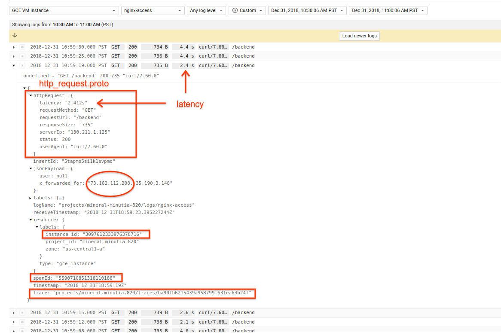
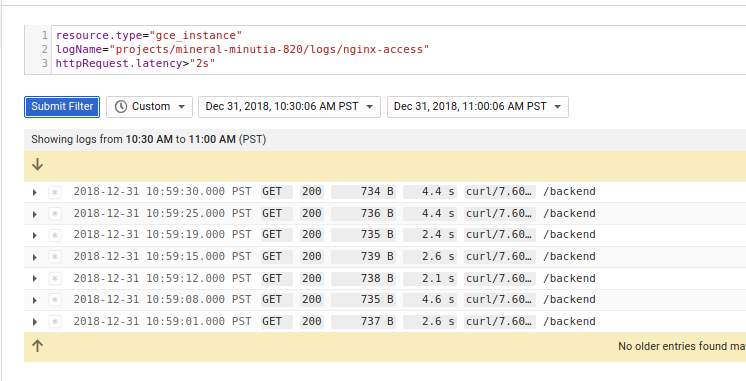
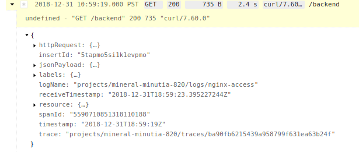
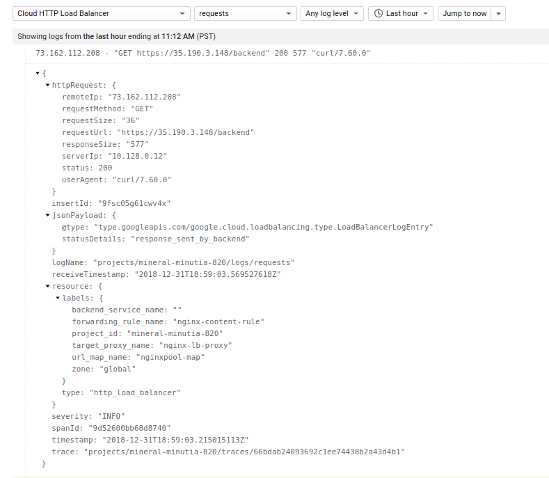
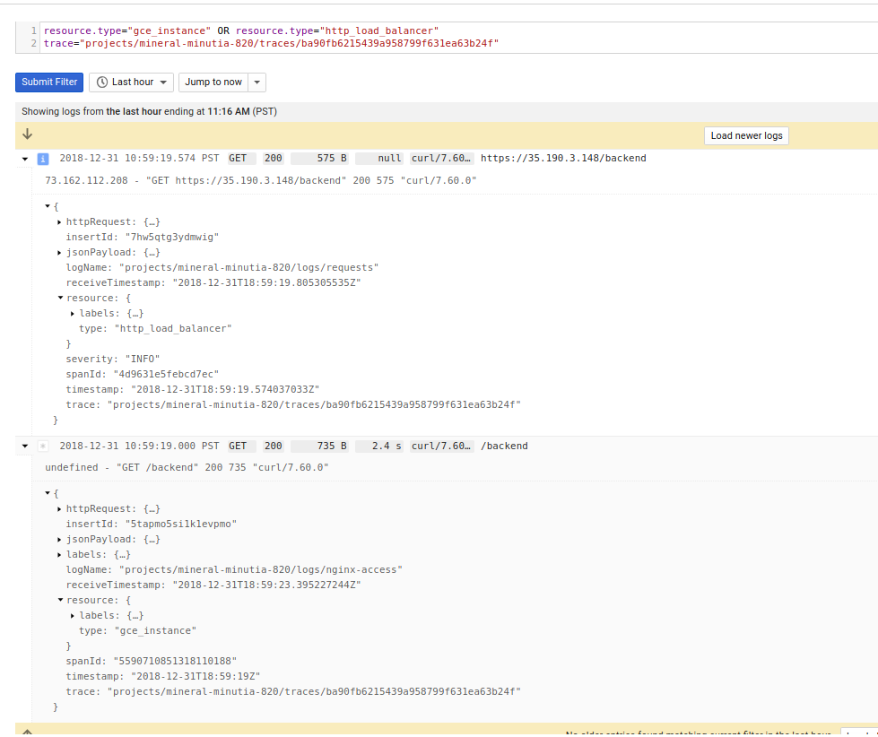
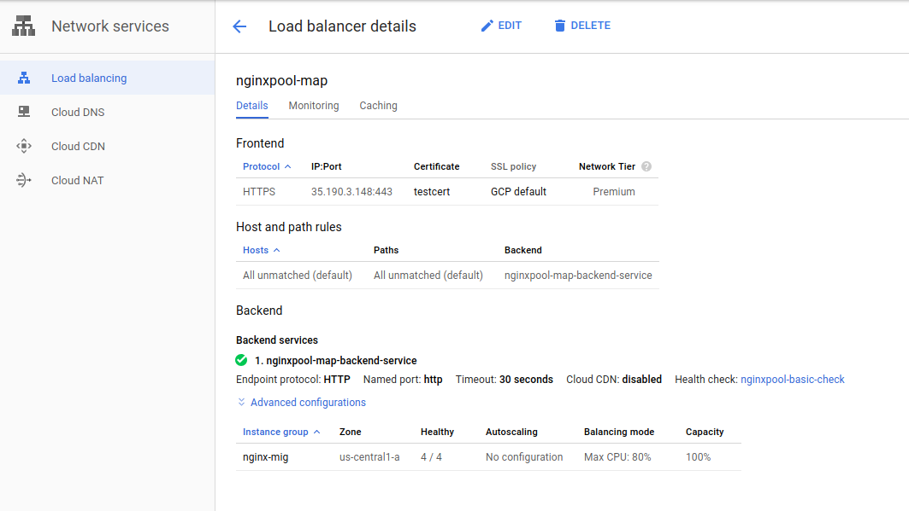
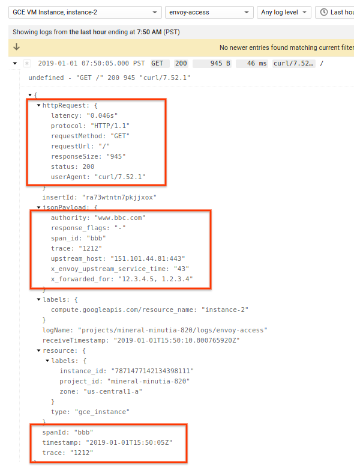

# Envoy, Nginx, Apache HTTP Structured Logging with Google Cloud Logging


Google Cloud Logging provides several plugins that allows you to easily emit structured logs for common applications.

For example, if you install the Stackdriver Logging agent, you can get logs using the following fluentd plugins:

- [https://cloud.google.com/monitoring/agent/plugins/](https://cloud.google.com/monitoring/agent/plugins/)

This sample demonstrates two of these plugins (`apache` and `nginx`) and how to configure them to emit not just structured JSON logs but as a specific [HttpRequest](https://cloud.google.com/logging/docs/reference/v2/rest/v2/LogEntry#httprequest) protocol buffer.  This article also describes how to configure `Envoy` proxy for similar httpRequest logging.

The script below sets up the *full* sample stack with Google Cloud L7 HTTPS loadbalancer and a managed instance group running the webserver.  It does not demo `Envoy` with the L7 but you can set that up pretty easily with the template below.

In addition to the `HttpRequest` protocolbuffer, this example and configuration also includes the following in the emitted `LogEntry`

- `trace`:  This is the `X-Cloud-Trace-Context` header sent via the L7 Loadbalancer.  see [payload configurations](https://cloud.google.com/logging/docs/agent/configuration#process-payload
)
- `spanId`: Inbound requests from Google L7 LB includes trace and span to cover.
- `httpRequest.latency`: Latnecy value provided by `nginx/apache` and set as the [latency`](https://github.com/googleapis/googleapis/blob/master/google/logging/type/http_request.proto#L71) field
- `X-Forwarded-For` Header is logged when available.  That header is emitted by the L7 LB to indicate the _actual_ originating IP address for the request.  I've intentionally left the `clientIp` filed for the HttpRequest as the one provided though as a followup `TODO:` you are welcome to replace that value with the one extracted from this header.

Note, Stackdriver doens't by default support all fluentd plugins but just the ones listed above.  You are free to customer and define your own plugin described in the documentation in the following article [auditd agent config for Stackdriver Logging](https://medium.com/google-cloud/auditd-agent-config-for-stackdriver-logging-c27d1431ed3a)


For Reference:

- [Stackdriver Logging Agent](https://cloud.google.com/logging/docs/agent/)
- [Stackdriver Structured Logging](https://cloud.google.com/logging/docs/structured-logging)
- [Stackdriver Logging LogEntry](https://cloud.google.com/logging/docs/reference/v2/rest/v2/LogEntry)
- [http_request.proto](https://github.com/googleapis/googleapis/blob/master/google/logging/type/http_request.proto)
- [Google Cloud Logging plugin for fluentd](https://github.com/GoogleCloudPlatform/fluent-plugin-google-cloud)
- [Getting more value from your Stackdriver logs with structured data](https://cloud.google.com/blog/products/gcp/getting-more-value-from-your-stackdriver-logs-with-structured-data)


## Usecases

First, i'll just show what this will look like in `nginx-access` logs:

- 


### Filter by latency

Now that the logs are structured, we can apply a direct filter on those fields.  For example, the following shows which requests took more than `2s` to respond:

```
resource.type="gce_instance"
logName="projects/mineral-minutia-820/logs/nginx-access"
httpRequest.latency>"2s"
```

- 

### Trace Context logging

Each request in this specific example traverses Google L7 loadbalancer which also get logged.  What that means is you can now trace a request in the LB logs down to the specific instnace in the managed group that handled the call.  For example, if you start with a `traceID` from the nginx logs

- nginx LogEntry: 
  ```trace:  "projects/mineral-minutia-820/traces/ba90fb6215439a958799f631ea63b24f"```
  

You can find its corresponding entry in the LB `LogEntry`

- LB `LogEntry`:
  ```trace:  "projects/mineral-minutia-820/traces/ba90fb6215439a958799f631ea63b24f"```
  


or run a query like this to cover both.

```
resource.type="gce_instance" OR resource.type="http_load_balancer"
trace="projects/mineral-minutia-820/traces/ba90fb6215439a958799f631ea63b24f"
```
 

### Combined LogViewer

Now that the frontend server is logging the inital `httpRequest` as well as the `trace`/`spanId`, a backend application that emits the `traceId` in a log line will result in log grouping.   What that means is the inital request and application logs are grouped in a `parent`/`child` format as described in the following articles:
- [Combining correlated Log Lines in Google Stackdriver](https://medium.com/google-cloud/combining-correlated-log-lines-in-google-stackdriver-dd23284aeb29)

And just for reference (and becasue i authored it, :), here is the same impelmented within a webframework (`Flask`), directly

- [https://github.com/salrashid123/flask-gcp-log-groups](https://github.com/salrashid123/flask-gcp-log-groups)

This article does not demonstrate this capability but if its useful, i can be convinced to provide an example.

### Filter by SourceIP

If requests traverse the Google Loadbalancer, it injects the standard `X-Forwarded-For` header which includs the actual source IP address as well as the proxies this request traversed.   In the case for Google, it will include the incident SSL Proxy.

For example

```
x_forwarded_for:  "73.162.112.208, 35.190.3.148"   
```

The origin ip is actually `73.162.112.208`.   Currently, the parsers just uses the provided value as the `clientIP` which is not the derived origin value (its still the loadbalancer).  If you want to parse the actual origin IP, you will need to parse out the value from the header and add it to for the `remoteIP`.

For apache, its something like this:

`parser_apache.rb`:
```ruby
host = m['host'].delete(' ')
host = host.split(',').first
```

`apache.conf`
```
  <record>
    ...
    httpRequest ${ {..... "remoteIp" => record['host'] ..... }
    ...
  </record>
```

## NGINX

If you prefer to use `nginx`, you can create the full LB->nginx managed instance group by running the following commands in sequnce:

### Create

```bash

gcloud compute instance-templates create nginx-template \
    --image-family=debian-9  --image-project=debian-cloud --scopes https://www.googleapis.com/auth/logging.write  --machine-type "g1-small"  \
     --tags "nginxpool" \
    --metadata startup-script='#! /bin/bash    
    sudo apt-get update && apt-get install -y wget nginx curl

    curl -sSO "https://dl.google.com/cloudagents/install-logging-agent.sh"
    bash install-logging-agent.sh --structured

    echo `hostname` > /var/www/html/index.html

    wget -O /etc/nginx/nginx.conf https://gist.githubusercontent.com/salrashid123/3b407a8cd2246a33fc247d8a697c8049/raw/bfc93e0359299fa8bdf87a2b7f2d8eec652d0517/nginx.conf

    wget -O /etc/nginx/sites-enabled/default https://gist.githubusercontent.com/salrashid123/233f8117be04f37f6e1684bd73f390dc/raw/3cdd05aa400b37530098eb6590153241037e128e/nginx-site-enabled-default

    wget -O /opt/google-fluentd/embedded/lib/ruby/gems/2.4.0/gems/fluentd-1.2.5/lib/fluent/plugin/parser_nginx.rb https://gist.githubusercontent.com/salrashid123/7377fc4d279ac2e002fcd9ed005a922b/raw/fee7bcb4d63fb58540dbcaa493517e572d46354c/parser_nginx.rb

    wget -O /etc/google-fluentd/config.d/nginx.conf https://gist.githubusercontent.com/salrashid123/6560b1297b3ddf60d2675f6fa8c925a5/raw/9af7021412d979fca724cb66d3b519972a7ff26a/google-fluentd-nginx.conf

    # until https://github.com/GoogleCloudPlatform/fluent-plugin-google-cloud/pull/275 in included in the current installed version version
    wget -O /opt/google-fluentd/embedded/lib/ruby/gems/2.4.0/gems/fluent-plugin-google-cloud-0.7.2/lib/fluent/plugin/out_google_cloud.rb https://raw.githubusercontent.com/GoogleCloudPlatform/fluent-plugin-google-cloud/master/lib/fluent/plugin/out_google_cloud.rb

    export random_delay=$((RANDOM % 5))
    sed -i "s/httpbin\/delay\/2/httpbin\/delay\/$random_delay/" /etc/nginx/sites-enabled/default

    service nginx restart
    service google-fluentd restart'


gcloud compute instance-groups managed create nginx-mig  --template=nginx-template --size=4 --zone=us-central1-a
gcloud compute firewall-rules create firewall-rules-nginx --allow=tcp:8080 --source-ranges=130.211.0.0/22,35.191.0.0/16  --target-tags=nginxpool
gcloud compute http-health-checks create nginxpool-basic-check --port 8080  --request-path="/_ah/health"
gcloud compute instance-groups managed set-named-ports nginx-mig --named-ports=http:8080 --zone us-central1-a
gcloud compute backend-services create nginxpool-map-backend-service   --global  --protocol HTTP --port-name=http --http-health-checks nginxpool-basic-check
gcloud compute backend-services add-backend nginxpool-map-backend-service \
    --balancing-mode UTILIZATION \
    --max-utilization 0.8 \
    --capacity-scaler 1 \
    --instance-group nginx-mig \
    --instance-group-zone us-central1-a --global
gcloud compute url-maps create nginxpool-map --default-service nginxpool-map-backend-service
```

If can use the certs provided in this repo but if you prefer to setup your own...
```
openssl req -x509 -newkey rsa:2048 -keyout key.pem -out cert.pem -days 365 --nodes -subj "/C=US/ST=California/L=San Francisco/O=Google/OU=Cloud/CN=server.somedomain.com"
```

then finish off the step:

```
gcloud compute ssl-certificates create testcert --certificate=cert.pem --private-key=key.pem
gcloud alpha compute target-https-proxies create nginx-lb-proxy --url-map=nginxpool-map --ssl-certificates=testcert	 --global
gcloud compute forwarding-rules create nginx-content-rule  --global --target-https-proxy nginx-lb-proxy --ports 443
```

You should end up with an L7 LB pointing to an instance group with four servers

>> NOTE: it may take upto `10 minutes` for the L7 LB to provide the initial provisioning so feel free to get a coffee now

- 


### Test

Once the LB is seutp you can send traffic down

```
export GATEWAY_IP=$(gcloud compute forwarding-rules describe nginx-content-rule --format="value(IPAddress)" --global)
echo $GATEWAY_IP

for i in {1..100}; do curl -o /dev/null -sk -w "%{time_total}\n" https://$GATEWAY_IP/backend; sleep 1; done

2.755932
0.708667
4.758257
2.251039
2.703043
2.542590
4.603907
4.555793
```

The responses above indicate how long the specific backend took. As you see, since we applied a variable delay into each instance as part of the startup script, each VM will take a minimum amount of time to respond

### Delete

To delete the cluster, run the following in sequence:

```bash

gcloud compute forwarding-rules delete  nginx-content-rule  -q --global
gcloud compute target-https-proxies delete nginx-lb-proxy -q
gcloud compute ssl-certificates delete testcert -q
gcloud compute url-maps delete  nginxpool-map -q
gcloud compute backend-services  remove-backend nginxpool-map-backend-service --instance-group=nginx-mig --global --instance-group-zone us-central1-a -q
gcloud compute backend-services delete nginxpool-map-backend-service --global -q
gcloud compute firewall-rules delete  firewall-rules-nginx  -q
gcloud compute instance-groups managed delete nginx-mig --zone us-central1-a -q
gcloud compute http-health-checks delete nginxpool-basic-check -q
gcloud compute instance-templates delete nginx-template -q

```

### Config

The following details the configurations used.  Eventually, this should also get rolled into the standard `google-fluentd` library so wont' be a need to add the custom code below.

#### nginx

*   ```/etc/nginx/nginx.conf```  
    - [https://gist.github.com/salrashid123/3b407a8cd2246a33fc247d8a697c8049](https://gist.github.com/salrashid123/3b407a8cd2246a33fc247d8a697c8049)

*   ```/etc/nginx/sites-enabled/default```
    - [https://gist.github.com/salrashid123/233f8117be04f37f6e1684bd73f390dc](https://gist.github.com/salrashid123/233f8117be04f37f6e1684bd73f390dc)

#### google-fluentd

* ```/opt/google-fluentd/embedded/lib/ruby/gems/2.4.0/gems/fluentd-1.2.5/lib/fluent/plugin/parser_nginx.rb```
    - [https://gist.github.com/salrashid123/7377fc4d279ac2e002fcd9ed005a922b](https://gist.github.com/salrashid123/7377fc4d279ac2e002fcd9ed005a922b)       

* ```/etc/google-fluentd/config.d/nginx.conf```
    - [https://gist.github.com/salrashid123/6560b1297b3ddf60d2675f6fa8c925a5](https://gist.github.com/salrashid123/6560b1297b3ddf60d2675f6fa8c925a5)

---

## Apache2


If you use `Apache2`, you can create the full stack by running the commands below in sequence.

### Create

```bash

gcloud compute instance-templates create apache-template \
    --image-family=debian-9  --image-project=debian-cloud --scopes https://www.googleapis.com/auth/logging.write  --machine-type "g1-small"  \
     --tags "apachepool" \
    --metadata startup-script='#! /bin/bash    
    sudo apt-get update && apt-get install -y wget apache2 curl

    a2enmod remoteip headers a2enmod ssl a2enmod proxy proxy_balancer a2enmod proxy_http
    curl -sSO "https://dl.google.com/cloudagents/install-logging-agent.sh"
    bash install-logging-agent.sh --structured

    wget -O /etc/apache2/apache2.conf https://gist.githubusercontent.com/salrashid123/d649a48d1fe6c5b68c10b2507284efde/raw/2c028beb0f2dc50700a34bb5e61c9ccf8b49dfe0/apache2.conf

    wget -O /etc/apache2/sites-enabled/000-default.conf https://gist.githubusercontent.com/salrashid123/4a1c6eaf69234238c7a86a70f94f44bc/raw/94546453176da45f58db99ce8d2b0a89c9ac1156/000-default.conf
    
    export random_delay=$((RANDOM % 5))
    sed -i "s/httpbin\/delay\/2/httpbin\/delay\/$random_delay/" /etc/apache2/sites-enabled/000-default.conf 

    sed -i "s/Listen 80/Listen 8080/" /etc/apache2/ports.conf
    mkdir /var/www/html/_ah/
    echo "ok" > /var/www/html/_ah/health

    wget -O /opt/google-fluentd/embedded/lib/ruby/gems/2.4.0/gems/fluentd-1.2.5/lib/fluent/plugin/parser_apache2.rb https://gist.githubusercontent.com/salrashid123/8a39aa41a125c714be7461c1a6d80f40/raw/ee7da7efd3da00a37b7fd9c70a52d59451f88e8c/parser_apache.rb

    wget -O /etc/google-fluentd/config.d/apache.conf https://gist.githubusercontent.com/salrashid123/8e0e8c610475ac9fd893c80325d5fc3a/raw/4e07039a44caf8311ef3793f27f8cdd86f1ae2f2/apache.conf

    # until https://github.com/GoogleCloudPlatform/fluent-plugin-google-cloud/pull/275 in included in the current installed version version
    wget -O /opt/google-fluentd/embedded/lib/ruby/gems/2.4.0/gems/fluent-plugin-google-cloud-0.7.2/lib/fluent/plugin/out_google_cloud.rb https://raw.githubusercontent.com/GoogleCloudPlatform/fluent-plugin-google-cloud/master/lib/fluent/plugin/out_google_cloud.rb

    service apache2 restart
    service google-fluentd restart'


gcloud compute instance-groups managed create apache-mig  --template=apache-template --size=4 --zone=us-central1-a
gcloud compute firewall-rules create firewall-rules-apache --allow=tcp:8080 --source-ranges=130.211.0.0/22,35.191.0.0/16  --target-tags=apachepool
gcloud compute http-health-checks create apachepool-basic-check --port 8080  --request-path="/_ah/health"
gcloud compute instance-groups managed set-named-ports apache-mig --named-ports=http:8080 --zone us-central1-a
gcloud compute backend-services create apachepool-map-backend-service   --global  --protocol HTTP --port-name=http --http-health-checks apachepool-basic-check
gcloud compute backend-services add-backend apachepool-map-backend-service \
    --balancing-mode UTILIZATION \
    --max-utilization 0.8 \
    --capacity-scaler 1 \
    --instance-group apache-mig \
    --instance-group-zone us-central1-a --global
gcloud compute url-maps create apachepool-map --default-service apachepool-map-backend-service
```

If can use the certs provided in this repo but if you prefer to setup your own...

```
openssl req -x509 -newkey rsa:2048 -keyout key.pem -out cert.pem -days 365 --nodes -subj "/C=US/ST=California/L=San Francisco/O=Google/OU=Cloud/CN=server.somedomain.com"
```

then

```bash
gcloud compute ssl-certificates create testcert --certificate=cert.pem --private-key=key.pem
gcloud alpha compute target-https-proxies create apache-lb-proxy --url-map=apachepool-map --ssl-certificates=testcert	 --global
gcloud compute forwarding-rules create apache-content-rule  --global --target-https-proxy apache-lb-proxy --ports 443
```

### Delete

```bash
gcloud compute forwarding-rules delete  apache-content-rule  -q --global
gcloud compute target-https-proxies delete apache-lb-proxy -q
gcloud compute ssl-certificates delete testcert -q
gcloud compute url-maps delete  apachepool-map -q
gcloud compute backend-services  remove-backend apachepool-map-backend-service --instance-group=apache-mig --global --instance-group-zone us-central1-a -q
gcloud compute backend-services delete apachepool-map-backend-service --global -q
gcloud compute firewall-rules delete  firewall-rules-apache  -q
gcloud compute instance-groups managed delete apache-mig --zone us-central1-a -q
gcloud compute http-health-checks delete apachepool-basic-check -q
gcloud compute instance-templates delete apache-template -q
```

### Test

As with the example with `nginx`, you can send requests directly via curl in loop and gauge response times.

```bash
export GATEWAY_IP=$(gcloud compute forwarding-rules describe apache-content-rule --format="value(IPAddress)" --global)
echo $GATEWAY_IP

for i in {1..100}; do curl -o /dev/null -sk -w "%{time_total}\n" https://$GATEWAY_IP/backend; sleep 1; done
```
---

### Config

The following details the configurations used for `apache`.  Eventually, this should also get rolled into the standard `google-fluentd` library so wont' be a need to add the custom code below.

#### Apache2

* ```/etc/apache2/apache2.conf``` 
    - [https://gist.github.com/salrashid123/d649a48d1fe6c5b68c10b2507284efde](https://gist.github.com/salrashid123/d649a48d1fe6c5b68c10b2507284efde)

*  ```/etc/apache2/sites-enabled/000-default.conf```
    - [https://gist.github.com/salrashid123/4a1c6eaf69234238c7a86a70f94f44bc](https://gist.github.com/salrashid123/4a1c6eaf69234238c7a86a70f94f44bc)


#### google-fluentd

*  ```/opt/google-fluentd/embedded/lib/ruby/gems/2.4.0/gems/fluentd-1.2.5/lib/fluent/plugin/parser_apache2.rb```
    - [https://gist.github.com/salrashid123/8a39aa41a125c714be7461c1a6d80f40](https://gist.github.com/salrashid123/8a39aa41a125c714be7461c1a6d80f40)

* ```/etc/google-fluentd/config.d/apache.conf```
    - [https://gist.github.com/salrashid123/8e0e8c610475ac9fd893c80325d5fc3a](https://gist.github.com/salrashid123/8e0e8c610475ac9fd893c80325d5fc3a)


## Envoy

[Envoy](https://www.envoyproxy.io/) [Access logs](https://www.envoyproxy.io/docs/envoy/latest/configuration/access_log) is fairly customizable and can write to any number of targets.  For example, you can configure `envoy` to emit logs to remotely (see [envoy_control#accesslog](https://github.com/salrashid123/envoy_control#accesslog)) or in this article, locally to a log file where Cloud Logging can do the rest of the legwork.

This article includes two separate configurations for `envoy` and `google-fluentd`:    Default envoy settings and one optimized for GCP that includes the `cloud-trace-context` header.


### default

The steps to emit [default logs](https://www.envoyproxy.io/docs/envoy/latest/configuration/access_log#default-format-string) is fairly easy:  just set the path where the logs will write to

```yaml
    filter_chains:
    - filters:
      - name: envoy.http_connection_manager
        typed_config:  
          "@type": type.googleapis.com/envoy.extensions.filters.network.http_connection_manager.v3.HttpConnectionManager
          stat_prefix: ingress_http
          access_log:
          - name: envoy.access_loggers.file
            typed_config:
              "@type": type.googleapis.com/envoy.extensions.access_loggers.file.v3.FileAccessLog
              path: "/tmp/envoy.log"
```

### Custom header (cloud-trace-context)

You can customize envoy's logs easily by adding in fields like custom headers into the log file.  The following shows a snippet on now to setup the logs that extend the default configuration and just adds `%REQ(X-Cloud-Trace-Context)%`


```yaml
    filter_chains:
    - filters:
      - name: envoy.http_connection_manager
        typed_config:  
          "@type": type.googleapis.com/envoy.extensions.filters.network.http_connection_manager.v3.HttpConnectionManager
          stat_prefix: ingress_http
          access_log:
          - name: envoy.access_loggers.file
            typed_config:
              "@type": type.googleapis.com/envoy.extensions.access_loggers.file.v3.FileAccessLog
              path: "/tmp/envoy.log"
              format: "[%START_TIME%] \"%REQ(:METHOD)% %REQ(X-ENVOY-ORIGINAL-PATH?:PATH)% %PROTOCOL%\" %RESPONSE_CODE% %RESPONSE_FLAGS% %BYTES_RECEIVED% %BYTES_SENT% %DURATION% %RESP(X-ENVOY-UPSTREAM-SERVICE-TIME)% \"%REQ(X-FORWARDED-FOR)%\" \"%REQ(USER-AGENT)%\" \"%REQ(X-REQUEST-ID)%\" \"%REQ(:AUTHORITY)%\" \"%UPSTREAM_HOST%\" \"%REQ(X-Cloud-Trace-Context)%\"\n" 
```

### Testing

To test this, you can incorporate the envoy configurations provided into a similar VM as described above.  Remember to copy 

```
parser_envoy.rb --> /opt/google-fluentd/embedded/lib/ruby/gems/2.4.0/gems/fluent-plugin-google-cloud-0.7.2/lib/fluent/plugin/out_google_cloud.rb
```

```
envoy.conf --> /etc/google-fluentd/config.d/envoy.conf
```

If you are on a VM with `google-fluentd` and the configurations settings above, restart fluentd and run envoy:


```
./envoy -l info -c envoy_config.yaml 
```


Either send in a request via the LB or directly to test:

```
curl -H "X-Cloud-Trace-Context: 1212/bbb" -H "X-Forwarded-For: 12.3.4.5, 1.2.3.4" http://localhost:10000
```

In cloud logging, you will see the standard `httpRequest` payload as well as envoy specific headers:



From there, you can further customize the headers you want to caputure by modifying the fluentd and envoy configurations.


---

Thats all folks

---