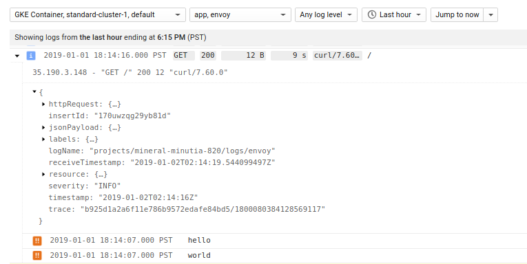

## LogEntry.httpRequest logging with Envoy FrontProxy


Sample GKE application which places `Envoy` infront of your application.  All envoy does here is logs the inboud [LogEntry.httpRequest](https://cloud.google.com/logging/docs/reference/v2/rest/v2/LogEntry#httprequest) and then forwards the request to the application.

That is:

```user-> Cloud L7LB --> POD(envoy->app)```

The applicaton in this case will just 'print' log statemets with the origin `traceId`.   Since both the `httpRequest` and application logs contains the traceId, a 'parent/child` log format is setup.

For more information, see:

- [Combining correlated Log Lines in Google Stackdriver](https://medium.com/google-cloud/combining-correlated-log-lines-in-google-stackdriver-dd23284aeb29)


## Build


```
gcloud container clusters create standard-cluster-1 --num-nodes=2

export PROJECT_NAME=$(gcloud config list --format="value(core.project)")
```

```bash
  cd proxy
  docker build -t gcr.io/$PROJECT_NAME/proxy .
```

```bash
  cd app
  docker build -t gcr.io/$PROJECT_NAME/app .
```

upload

```
  gcloud docker -- push gcr.io/$PROJECT_NAME/proxy 
  gcloud docker -- push gcr.io/$PROJECT_NAME/app
```


## Deploy

```
  cd gke
  sed -i "s/PROJECT_NAME/$PROJECT_NAME/g" my-deployment.yaml

  kubectl apply -f .
```


---

```
$ export GATEWAY_IP=$(kubectl get ing/myapp-srv-ingress -o jsonpath='{.status.loadBalancer.ingress[0].ip}')
35.190.3.148


curl -vk https://$GATEWAY_IP/
```

then view the log:




